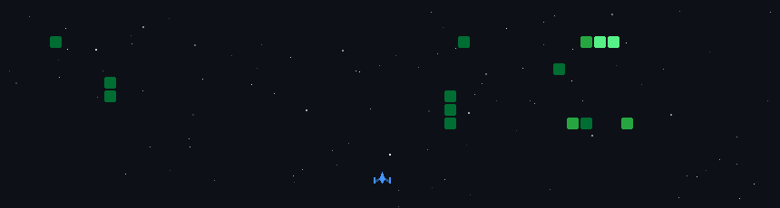

  

  

  🎓 <b>Computer Engineering Student</b> @ <b>Montreal, Canada</b>  
  ⚙️ Building across <b>software • hardware • product design</b>  
  🏎️ Formula 1 fan | 🌌 Space enthusiast  
  📬 Reach me at: <b>jbijukul@gmail.com</b>

  
  &nbsp;&nbsp;
  

 

  

<h2 align="center">🔥 Highlighted Stack 🔥</h2>
 

  <!-- Core & Frontend -->
  

  <!-- Backend & APIs -->
  

  <!-- Databases -->
  

  <!-- Systems & DevOps -->
  

  <!-- Embedded & Hardware -->
  

  <!-- Product & Design -->
  

 

  

  

| |
|:--:|
|  |
|  |
|  |
|  |

  

